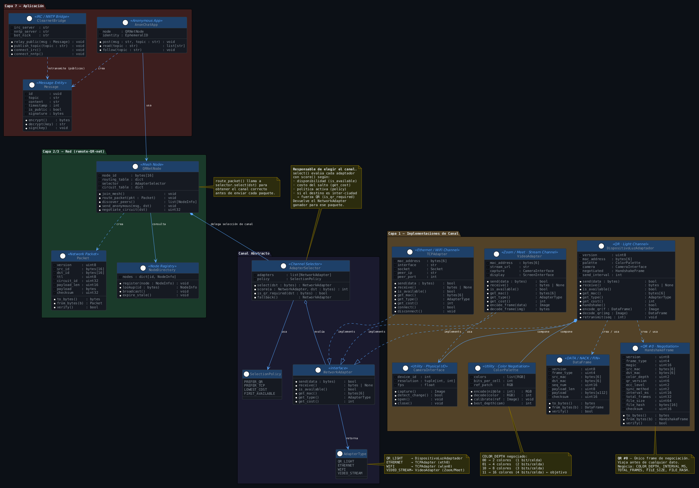

# QR-NET — Kick-off del Proyecto
### Redes de Computadoras · Ingeniería de Computación · TEC · Abril 2026
**Profesor:** Kevin Moraga

**Estudiante:** Ion Dolanescu

---

## 1. Introducción

En un mundo donde la infraestructura de telecomunicaciones es controlada —o directamente censurada— por actores gubernamentales o corporativos, la necesidad de canales de comunicación alternativos y anónimos es urgente. Este proyecto propone construir **QR-NET**: una red de comunicación que usa **luz codificada en imágenes QR como medio físico**, apilando sobre ella capas completas del modelo OSI hasta llegar a una aplicación de microblogging anónimo.

La idea central es simple pero poderosa: dos cámaras apuntándose pueden ser el equivalente funcional de un cable Ethernet, sin dejar rastro físico permanente, y capaces de operar incluso a través de una pantalla compartida en una videollamada, cruzando continentes.

```
┌─────────────────────────────────────────────────────────────┐
│                        QR-NET Stack                         │
├─────────────────────────────────────────────────────────────┤
│  Capa 7 (App)    │  Chat anónimo (mesh) + IRC/NNTP público  │
│  Capa 3 (Red)    │  remote-QR-net: mesh routing anónimo     │
│  Capa 2 (Enlace) │  Tramas de 128 bytes, MAC análogo        │
│  Capa 1 (Física) │  Luz → QR multicolor → Cámara            │
└─────────────────────────────────────────────────────────────┘
```

### Estrategia General de Solución

El proyecto se construye de abajo hacia arriba, capa por capa:

```
[NODO A]                                          [NODO B]
  App  ←──────────────────────────────────────→   App
  Net  ←── TCP/IP o QR-over-light (mesh) ──────→  Net
  MAC  ←── DispositivoLuzAdaptador ────────────→  MAC
  PHY  ←── [Pantalla QR] ~~~~luz~~~~ [Cámara] →  PHY
```

Para maximizar la tasa de transferencia (objetivo del punto extra) se empleará **QR multicolor**: en lugar de los 2 símbolos clásicos (negro/blanco = 1 bit/celda), se usarán **hasta 16 colores distintos**, codificando **4 bits por celda** y multiplicando la densidad de información por 4 sin aumentar el tamaño del código. La capacidad de color se negocia en el handshake inicial y se adapta al hardware real del par.

El nombre del protocolo será QR-NET Rainbow 1
---

## 2. Protocolo de Capa 1: Handshake y Temporización

La transmisión de archivos grandes (caso de prueba: **1 GB**) requiere generar miles de QR en secuencia. Antes de enviar el primer byte de datos, el **QR #0** actúa como frame de negociación de capacidades (*Capability Advertisement Frame*), equivalente al SYN de TCP o al LCP de PPP.

### 2.1 Flujo de Negociación (3-Way Handshake)

```
TRANSMISOR (A)                           RECEPTOR (B)
      │                                        │
      │─── QR[0] SYN ─────────────────────────▶│
      │    "Puedo 16 colores, propongo 150ms"  │
      │                                        │
      │◀── QR[0] SYN-ACK ──────────────────────│
      │    "Solo puedo 8 colores, acepto 150ms"│
      │                                        │
      │─── QR[0] ACK ─────────────────────────▶│
      │    "Acordado: 8 colores, 150ms"        │
      │                                        │
      │─── QR[1..N] DATA ─────────────────────▶│  ← archivo en bloques
      │                                        │
      │◀── NACK(seq=847) ──────────────────────│  ← retransmisión selectiva
      │─── QR[847] retransmit ───────────────▶ │
      │                                        │
      │─── QR[N+1] FIN ───────────────────────▶│
      │◀── FIN-ACK ────────────────────────────│
      │                                        │
      ✓  Verificar FILE_HASH (SHA-128)         │
```

### 2.2 Estructura del Frame de Handshake (QR #0)

```
 0                   1                   2                   3
 0 1 2 3 4 5 6 7 8 9 0 1 2 3 4 5 6 7 8 9 0 1 2 3 4 5 6 7 8 9 0 1
+-+-+-+-+-+-+-+-+-+-+-+-+-+-+-+-+-+-+-+-+-+-+-+-+-+-+-+-+-+-+-+-+
| VERSION (4b)  | FRAME_TYPE(4b)|       MAGIC = 0x4E51 (16b)    |
+-+-+-+-+-+-+-+-+-+-+-+-+-+-+-+-+-+-+-+-+-+-+-+-+-+-+-+-+-+-+-+-+
|                     SRC_MAC  (48 bits)                        |
+-+-+-+-+-+-+-+-+-+-+-+-+-+-+-+-+-+-+-+-+-+-+-+-+-+-+-+-+-+-+-+-+
|                     DST_MAC  (48 bits)                        |
+-+-+-+-+-+-+-+-+-+-+-+-+-+-+-+-+-+-+-+-+-+-+-+-+-+-+-+-+-+-+-+-+
|CD(2)|GRID(6)  | ECC(2)|SYNC(2)|    FRAME_INTERVAL_MS (16b)    |
+-+-+-+-+-+-+-+-+-+-+-+-+-+-+-+-+-+-+-+-+-+-+-+-+-+-+-+-+-+-+-+-+
| COMP(4)|         RESERVED (28b)                               |
+-+-+-+-+-+-+-+-+-+-+-+-+-+-+-+-+-+-+-+-+-+-+-+-+-+-+-+-+-+-+-+-+
|                   TOTAL_FRAMES  (32 bits)                     |
+-+-+-+-+-+-+-+-+-+-+-+-+-+-+-+-+-+-+-+-+-+-+-+-+-+-+-+-+-+-+-+-+
|                   FILE_SIZE     (64 bits)                     |
+-+-+-+-+-+-+-+-+-+-+-+-+-+-+-+-+-+-+-+-+-+-+-+-+-+-+-+-+-+-+-+-+
|                   FILE_HASH     (128 bits / SHA-128)          |
+-+-+-+-+-+-+-+-+-+-+-+-+-+-+-+-+-+-+-+-+-+-+-+-+-+-+-+-+-+-+-+-+
|   RESERVED (8b)               |       CHECKSUM CRC-16 (16b)   |
+-+-+-+-+-+-+-+-+-+-+-+-+-+-+-+-+-+-+-+-+-+-+-+-+-+-+-+-+-+-+-+-+
```

| Campo | Bits | Descripción |
|---|---|---|
| `VERSION` | 4 | Versión del protocolo QR-NET |
| `FRAME_TYPE` | 4 | `0x0`=SYN · `0x1`=SYN-ACK · `0x2`=ACK |
| `MAGIC` | 16 | `0x4E51` ("QN") — identifica QR-NET |
| `CD` (Color Depth) | 2 | `00`=2col · `01`=4col · `10`=8col · `11`=16col |
| `GRID` | 6 | Tamaño de la grilla custom en múltiplos de 8 (ej. `0x08`=64) |
| `ECC` | 2 | Nivel de corrección de error embebido en la grilla |
| `SYNC` | 2 | `00`=timer · `01`=visual diff · `10`=tick QR · `11`=híbrido |
| `FRAME_INTERVAL_MS` | 16 | Tiempo entre QR en milisegundos |
| `COMP` | 4 | Algoritmo de compresión: `0x0`=ninguno · `0x1`=zstd · `0x2`=lz4 · `0x3`=brotli |
| `TOTAL_FRAMES` | 32 | Cantidad de QR de datos a transmitir |
| `FILE_SIZE` | 64 | Tamaño del archivo **original** en bytes |
| `FILE_HASH` | 128 | Hash SHA-128 del archivo original para verificación final |

### 2.3 Grilla Custom


```
  ┌──────────────────────────────────────────┐
  │  ZS ZS ZS ZS ZS ZS ZS ZS ... ZS ZS ZS    │  ← Zona de silencio (2 módulos)
  │  ZS ┌────────────────────────────────┐ ZS│
  │  ZS │ FP  · · · · · · · · · ·  FP    │ ZS│  FP = Finder Pattern (7×7)
  │  ZS │  ·                        ·    │ ZS│
  │  ZS │  ·     DATOS + ECC        ·    │ ZS│
  │  ZS │  ·   (área de payload)    ·    │ ZS│
  │  ZS │  ·                        ·    │ ZS│  CAL = Celda de calibración
  │  ZS │ FP  · · · · · [CAL] · ·  ·     │ ZS│       de color (4×4 módulos)
  │  ZS └────────────────────────────────┘ ZS│
  │  ZS ZS ZS ZS ZS ZS ZS ZS ... ZS ZS ZS    │
  └──────────────────────────────────────────┘
  Total: 65×65 módulos (estandar)
  Zona de silencio: 2 módulos (vs 4 del estándar)
  Área útil interna: 61×61 módulos
  Finder patterns: 3 × (7×7) = 147 módulos reservados
  Celda de calibración: 4×4 = 16 módulos reservados
  Módulos de payload disponibles: 61×61 - 147 - 16 = 3,558 módulos
```
**Justificación de zona de silencio de 2 módulos:** dado que ambos nodos conocen de antemano el tamaño exacto de la grilla (negociado en handshake) y la cámara opera en condiciones controladas (fondo neutro, encuadre fijo), el margen de 2 módulos es suficiente para que el detector de bordes de OpenCV identifique la grilla sin ambigüedad. Reducirlo de 4 a 2 recupera 2 filas y 2 columnas de módulos útiles por lado.

**Capacidad por frame con 16 colores:**

```
  3,558 módulos × 4 bits/módulo = 14,232 bits = 1,779 bytes por frame
  Restando cabecera DataFrame (16 bytes overhead) → 1763 bytes de payload neto esperado.

  Comparación vs QR estándar v10 (57×57, 2 colores):
    · Estándar:   ~500 bytes/frame  (nivel ECC M) (confio en la ia para este dato)
    · QR-NET R1:  ~1,702 bytes/frame con 16 colores  → ×3.4 de mejora
```
---

## 3. Alcance Físico del Canal Óptico

La distancia máxima de transmisión depende de la resolución del sensor y del tamaño físico del QR en pantalla. Para clasificar colores correctamente, cada módulo debe subtender al menos **3–5 píxeles** en el sensor de la cámara receptora.

### 3.1 Estimación de distancia máxima por escenario de hardware

| Escenario | Pantalla / QR físico | Cámara | Distancia estimada |
|---|---|---|---|
| Laptop a laptop | 15" FHD — QR ~12 cm | Webcam integrada 1080p | **0.8 – 1.5 m** |
| Monitor a webcam USB | 27" 4K — QR ~20 cm | Webcam externa 1080p 60fps | **1.5 – 3.0 m** |
| Proyector a cámara | Proyección 1 m de lado | DSLR/mirrorless 4K | **4 – 8 m** |
| Video compartido (Zoom/Meet) | Virtual — sin distancia física | Cualquiera | **sin límite físico** |

### 3.2 Factores limitantes y mitigaciones

```
  Factor               Impacto en canal        Mitigación propuesta
  ─────────────────────────────────────────────────────────────────
  Resolución de cámara  Claridad de módulos     Usar cámara ≥ 1080p
  Iluminación variable  Error clasif. colores   Celda calibración en QR #0
  Compresión H.264      Destruye colores finos  Usar canal sin pérdida / PNG
  Velocidad de cambio   Blur entre frames       Intervalo ≥ 100ms
  Tamaño de módulo QR   Campo visual mínimo     QR versión ≥ 10 en pantalla ≥24"
  Reflexión en pantalla Saturación de color     Apantallar fuentes directas
```

### 3.3 Configuración de referencia para la defensa

```
  Pantalla :   Monitor 24" — QR a pantalla completa (~20 cm de lado)
  Cámara   :   Webcam 1080p 30fps en trípode
  Distancia:   1.0 – 1.5 m, sin obstáculos
  Luz      :   Ambiente neutro, sin reflejo directo sobre pantalla
  Color    :   Negociado en handshake (objetivo: 8–16 colores)
  Intervalo:   100 – 200 ms por QR
```

---
## 4. Pipeline de Captura: Cola FIFO de Frames

Uno de los cuellos de botella más críticos en el canal óptico es la dependencia secuencial entre captura y decodificación: si el algoritmo de clasificación de colores tarda 80ms por frame y el intervalo entre QR es de 100ms, existe solo un margen de 20ms de holgura. Cualquier variación destruye frames.

La solución es implementar un **pipeline productor-consumidor** con una cola FIFO thread-safe que desacopla completamente la captura de la decodificación.

### 4.1 Arquitectura del Pipeline

```
  Hilo CAPTURA (productor)          Hilo DECODIFICADOR (consumidor)
  ────────────────────────          ───────────────────────────────
  loop:                             loop:
    img ← camera.capture()            img ← fifo_queue.get()
    if detect_change(img):            frame ← decode_qr(img)
      fifo_queue.put(img)             classify_colors(frame)
    sleep(interval_ms)                emit_bytes(frame.payload)
         │                                      ▲
         └──────────── FIFO Queue ──────────────┘
                      (thread-safe)
                      maxsize = N
```

### 4.2 Comportamiento de la cola bajo distintas condiciones

| Condición | Comportamiento |
|---|---|
| Decodificador más rápido que cámara | Cola vacía la mayoría del tiempo — nominal |
| Decodificador más lento que cámara | Cola crece — frames se acumulan en buffer |
| Cola llena (`maxsize` alcanzado) | Política configurable: **drop-oldest** o **block** |
| Frame duplicado en la cola | Detectado por hash de imagen — descartado |

## 5. Compresión de Datos

Antes de fragmentar el archivo en frames QR, los datos se comprimen para reducir la cantidad total de frames necesarios y por tanto el tiempo de transmisión. La compresión opera en la capa de sesión, por encima del `DispositivoLuzAdaptador`, y es transparente para las capas inferiores.

### 5.1 Algoritmo seleccionado: zstd (Zstandard)

**zstd** es el algoritmo recomendado por tres razones concretas para este caso de uso:

```
  Criterio              zstd (nivel 3)   gzip      lz4
  ──────────────────────────────────────────────────────
  Ratio (texto)         ~65% reducción   ~62%      ~50%
  Ratio (binario)       ~40% reducción   ~38%      ~30%
  Velocidad compresión  ~500 MB/s        ~30 MB/s  ~700 MB/s
  Velocidad decomp.     ~1,700 MB/s      ~300 MB/s ~2,000 MB/s
  Soporte streaming     ✓ nativo         ✓         ✓
  Memoria requerida     ~2 MB            ~256 KB   ~64 KB
```
### 5.2 Impacto en throughput efectivo

```
  Sin compresión (1 GB, 16 colores, 100ms/frame):
    ~1,702 bytes/frame × 10 fps = 17,020 bytes/s = ~16.6 KB/s

  Con zstd nivel 3 (ratio conservador 40% reducción):
    Datos efectivos: 1 GB × 0.6 = 614 MB
    Throughput efectivo: 16.6 KB/s ÷ 0.6 = ~27.7 KB/s equivalente

  Con zstd en archivo de texto (ratio 70% reducción):
    Datos efectivos: 1 GB × 0.3 = 307 MB
    Throughput efectivo: ~55.3 KB/s equivalente
```
### 5.3 Negociación del algoritmo en el handshake

El campo `COMP` (4 bits) del HandshakeFrame permite negociar el algoritmo en el QR #0:

```
  COMP 0x0 → Sin compresión  (compatibilidad máxima)
  COMP 0x1 → zstd nivel 3   (recomendado — balance ratio/velocidad)
  COMP 0x2 → lz4             (prioriza velocidad sobre ratio)
  COMP 0x3 → brotli          (prioriza ratio sobre velocidad)
  COMP 0x4–0xF → Reservado para versiones futuras
```

Si el receptor no soporta el algoritmo propuesto, responde en el SYN-ACK con el mejor algoritmo que sí soporta, siguiendo el mismo principio de negociación del mínimo común que el color depth y tasa de captura tolera.

## 6. Ambiente de Desarrollo

| Componente | Herramienta | Justificación |
|---|---|---|
| Lenguaje principal | **Python 3.12** | Prototipado rápido, ecosistema rico en visión y redes |
| Soporte bajo nivel | **C (gcc)** | Binario x86 final y rutinas críticas de rendimiento |
| Generación de QR | `qrcode`, `Pillow` | Generación y manipulación de QR multicolor |
| Lectura de QR / color | `OpenCV`, `pyzbar` | Detección y clasificación de color por celda |
| Red / protocolos | `Scapy`, `socket` | Construcción de paquetes en todas las capas |
| IRC (clearnet) | `InspIRCd` + `python-irc` | Servidor IRC estándar con bot de bridge |
| NNTP | `INN` o `Leafnode` | Publicación de tópicos públicos |
| Debugging | `Wireshark`, `tcpdump`, `loguru` | Inspección de tráfico en todas las capas |
| Control de versiones | **Git + GitHub** | Flujo con ramas por capa |
| CI / testing | `pytest` + GitHub Actions | Pruebas unitarias de codificación, checksum y routing |
| Documentación | **Markdown + LaTeX** | Según requisito del enunciado |
| Entorno | **Ubuntu 24.04 LTS** (x86) | Compatibilidad x86 garantizada |

### Flujo de Trabajo en Git

```
main
 └── dev
      ├── feat/capa1-qr-fisico        ← DispositivoLuzAdaptador + Handshake
      ├── feat/capa2-3-remote-qr-net  ← Mesh, routing, anonimato
      ├── feat/capa7-anon-chat        ← App de microblogging
      ├── feat/capa7-clearnet-irc     ← IRC + NNTP bridge
      └── feat/rfc                    ← Documento RFC en ASCII
```

---

## 7. Control de Versiones

**Repositorio:** `https://github.com/IonDola/proyecto-qr`

```
qr-net-redes2026/
├── src/
│   ├── capa1/
│   │   ├── handshake.py       # Negotiation Frame — QR #0
│   │   ├── color_palette.py   # Codificación multicolor (16 colores HSV)
│   │   ├── grid.py            # Grilla custom 64×64
│   │   ├── fifo_pipeline.py   # Cola FIFO productor-consumidor
│   │   ├── compression.py     # zstd streaming + negociación COMP
│   │   └── adaptador.py       # DispositivoLuzAdaptador
│   ├── capa2_3/               # remote-QR-net mesh
│   ├── capa7_anon/            # Chat anónimo
│   └── capa7_clearnet/        # IRC bot + NNTP
├── rfc/                       # RFC en ASCII puro
├── docs/                      # Documentación MD + LaTeX
├── tests/
└── bin/                       # Binario x86 compilado
```

---

## 8. Diagrama UML de Clases


### Decisiones de Diseño Clave

**1. `HandshakeFrame` como QR #0**
El primer frame de toda sesión negocia color depth, tamaño de grilla, algoritmo de compresión, intervalo de temporización, total de frames y hash del archivo. Nada se transmite antes de este acuerdo.

**2. Grilla custom 64×64 con zona de silencio de 2 módulos**
Formato propietario que maximiza el área útil de payload (~3,437 módulos) sin depender del estándar QR. La zona de silencio reducida es viable porque ambos nodos conocen el formato exacto de antemano.

**3. Cola FIFO productor-consumidor**
Desacopla la captura de la decodificación mediante dos hilos independientes y una cola thread-safe. Otorga hasta 3.2 segundos de margen al decodificador sin perder frames, a costa de ~16 MB de RAM de buffer.

**4. Compresión zstd con negociación en handshake**
El campo `COMP` de 4 bits permite acordar el algoritmo antes de la transmisión. zstd en modo streaming comprime y fragmenta simultáneamente sin cargar el archivo en RAM, con ratios de 40–70% según el tipo de dato.

**5. Retransmisión selectiva por NACK**
El receptor solicita únicamente los frames con error, sin reiniciar la sesión. Combinado con la cola FIFO, esto cubre tanto pérdidas por velocidad como por error de decodificación de color.

**6. `NetworkAdapter` y `AdapterSelector`**
Abstracción que permite al `QRNetNode` elegir entre canal óptico QR, Ethernet/WiFi o video stream sin conocer los detalles de cada medio. `AdapterSelector.select()` evalúa disponibilidad, costo y si el salto requiere cruzar ciudades (fuerza canal QR en ese caso).

**7. Versiones en todos los protocolos**
Primer nibble de toda trama y paquete reservado para `version`, garantizando compatibilidad futura desde el primer release.

**8. Anonimato por diseño en Capa 3**
Circuitos virtuales con identificadores efímeros: un nodo intermediario solo sabe a quién reenviar, nunca quién originó el mensaje.

---

*Documento preparado para la clase de Kick-off*